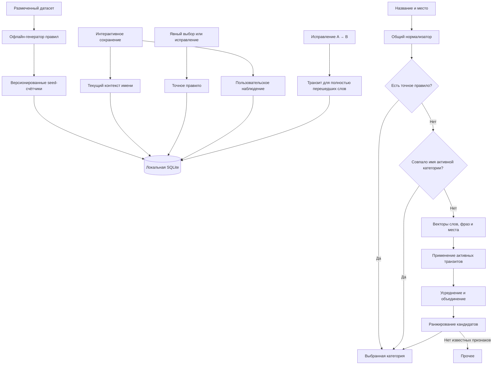
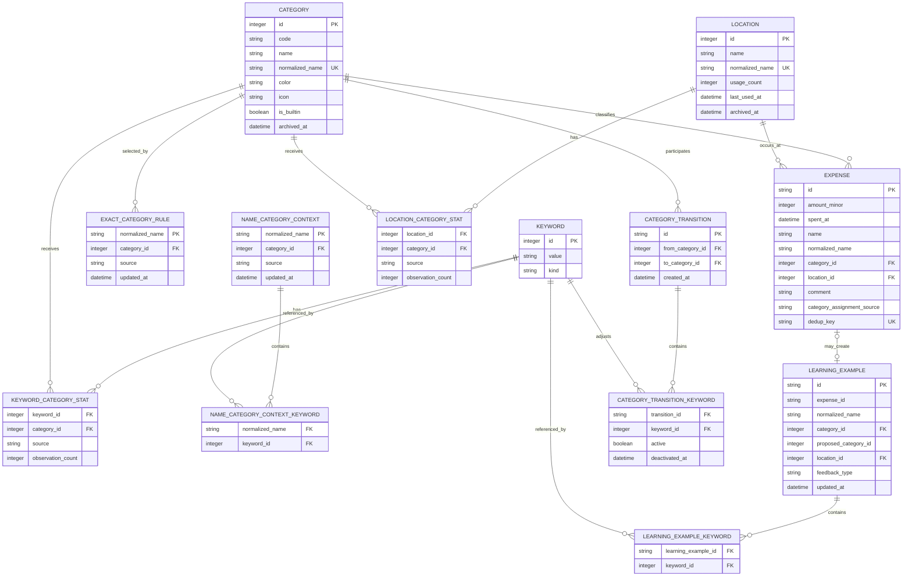

# Архитектура категоризации расходов и поиска мест

## 1. Назначение документа

Документ описывает локальный детерминированный механизм:

- нормализации наименований расходов и мест;
- автоматического выбора категории;
- формирования упорядоченного списка категорий-кандидатов;
- обучения на явном выборе пользователя;
- cold start на предобученном датасете;
- поиска и автодополнения мест;
- сохранения накопленных правил при очистке истории.

Решение соответствует ограничениям задания:

- работает полностью офлайн;
- не обращается к LLM и внешним сервисам;
- результат воспроизводим при одинаковых данных;
- исправление пользователя имеет безусловный приоритет;
- правила и параметры отделены от UI и прикладной логики.

## 2. Основные архитектурные решения

1. Категория выбирается не одной статической таблицей правил, а гибридным механизмом:
   - точное правило для полного нормализованного наименования;
   - вероятностные векторы слов, фраз и мест;
   - fallback-категория «Прочее».
2. При интерактивном сохранении покупки её итоговая категория формирует статистический опыт.
   Точное правило создаётся только после явного выбора или исправления категории. Нетронутая
   автоподстановка усиливает статистику, но не становится жёстким правилом полного имени.
   Автоматически категоризированный импорт и фоновый пересчёт без участия пользователя не обучают
   алгоритм.
3. Cold start обеспечивается результатом офлайн-обработки размеченного датасета покупок.
   В приложение поставляются счётчики и метаданные признаков, а не исполняемая ML-модель.
4. Для многословного наименования строится средний вектор известных слов и фраз.
5. В базе хранятся счётчики наблюдений. Вероятности вычисляются из них либо кешируются:
   одна вероятность без размера выборки недостаточна для последующего обучения.
6. Встроенные и пользовательские наблюдения хранятся раздельно. Большой исходный датасет
   не должен навсегда подавлять локальный опыт пользователя.
7. Имя новой категории обрабатывается тем же нормализатором и добавляет производный
   статистический опыт с отдельным источником `category_name`. Полное совпадение
   нормализованных имён покупки и активной категории обрабатывается отдельным category alias.
8. При исправлении категории обновляется не только точное правило: новый опыт учитывается
   во всех ключевых словах покупки. Для признаков, полностью перешедших из старой категории
   в новую, создаётся временная транзитная поправка.
9. Транзитная поправка влияет только на расчетный score. Базовые счётчики и вероятности
   сохраняются без поправки, чтобы последующий положительный опыт естественно вытеснил её.
10. SQLite FTS используется для полнотекстового поиска и автодополнения, но не выполняет
   русскую морфологическую нормализацию. Стемминг выполняется в общем Kotlin-компоненте.
11. Категории удаляются логически. Исторические расходы и накопленное обучение сохраняются.

## 3. Термины

**Исходное наименование** — строка, введённая пользователем, без изменений.

**Нормализованное наименование** — последовательность нормализованных признаков в исходном
порядке, используемая для точного сопоставления.

**Признак** — нормализованное слово, фраза в кавычках или нормализованное место.

**Точный вектор признака** — распределение вероятностей по всем активным категориям:

```text
V(feature) = [P(category_1 | feature), ..., P(category_K | feature)]
```

**Точное правило** — отображение полного `normalized_name` в явно выбранную пользователем
категорию либо однозначную seed-категорию. Принятая автоподстановка точного правила не создаёт.

**Текущий контекст имени** — последняя интерактивно сохранённая категория каждого уникального
`normalized_name`. Контекст нужен для определения полного перехода слов, но не участвует
в точном выборе категории.

**Category alias** — отдельный детерминированный сигнал:
`normalized(expense.name) = category.normalized_name`. Он не является exact rule покупки
и не записывается в `exact_category_rule`.

**Seed-данные** — результат обработки размеченного датасета, поставляемый вместе с приложением.

**Пользовательское наблюдение** — итог интерактивно сохранённой покупки. Источником может быть
принятая автоподстановка, явный выбор либо исправление.

**Категорийный транзит** — зафиксированный факт исправления категории `A → B`, используемый
для временного усиления полностью перешедших ключевых слов до накопления достаточного
положительного опыта в категории B.

**Базовая вероятность** — вероятность, рассчитанная только по seed- и пользовательским
наблюдениям, без транзитных поправок.

**Скорректированный score** — значение после применения транзитной поправки. До
перенормировки оно не является вероятностью.

## 4. Общая схема



## 5. Компоненты

### 5.1. TextNormalizer

Единственная реализация нормализации, используемая:

- приложением при сохранении и поиске;
- офлайн-генератором seed-данных;
- импортом и восстановлением;
- unit-тестами.

Офлайн-генератор рекомендуется реализовать как Kotlin/JVM CLI-модуль, использующий тот же
исходный код нормализатора. Это исключает различия между Python- и Kotlin-реализациями.

### 5.2. CategorizationRepository

Отвечает за:

- поиск точного правила;
- загрузку счётчиков признаков;
- вычисление вероятностных векторов;
- получение вектора места;
- атомарное сохранение пользовательского наблюдения;
- архивирование категорий;
- формирование объяснения результата.

### 5.3. CategorizationEngine

Чистый компонент без Android API и SQL. Получает нормализованный запрос и набор векторов,
возвращает:

```text
CategorizationResult
- selectedCategoryId
- orderedCandidates
- source
- confidence
- matchedFeatures
- usedFallback
```

Компонент должен быть полностью покрываем unit-тестами.

### 5.4. SeedDataGenerator

Офлайн-компонент:

1. читает размеченный датасет;
2. применяет production-нормализатор;
3. считает связи «признак — категория» и «место — категория»;
4. отбрасывает недостаточно подтверждённые признаки;
5. создаёт версионированный seed-артефакт;
6. формирует отчёт о качестве на отложенной выборке.

### 5.5. ExpenseSearchRepository

Использует SQLite FTS для поиска расходов и мест. Не участвует в вычислении категории:
категоризация работает через обычные индексированные таблицы признаков.

## 6. Нормализация текста

### 6.1. Pipeline

Нормализация выполняется в следующем порядке:

1. Unicode NFKC.
2. Удаление пробелов по краям.
3. Приведение к lowercase через `Locale.ROOT`.
4. Схлопывание повторяющихся пробелов.
5. Опциональное единообразное преобразование `ё` в `е`.
6. Извлечение фрагментов в кавычках до обычной токенизации.
7. Разделение оставшегося текста на Unicode-токены.
8. Удаление небольшого конфигурируемого списка стоп-слов.
9. Русский Snowball stemming для обычных слов (официальный `russianStemmer` 3.1.1;
   слова из `stemExceptions` и токены без кириллицы не стеммируются).
10. Сборка `normalized_name` в исходном порядке.

`TextNormalizer.VERSION` = 1 для этого pipeline.

Пример:

```text
Исходная строка:
  Кетостерил в "Столичке на Чкалова"

Признаки:
  кетостер
  столичке на чкалова

normalized_name:
  кетостер "столичке на чкалова"
```

Фраза в кавычках считается одним признаком. Для неё нормализуются Unicode, регистр и пробелы,
но внутренние слова не стеммируются и повторно не добавляются как отдельные признаки.

### 6.2. Почему не используется POS-фильтрация в первой версии

Определение частей речи может удалить полезные для расходов признаки:

- названия брендов и сетей;
- аббревиатуры;
- артикулы;
- числа;
- неизвестные словарю товары.

В первой версии используются стоп-слова, а не фильтр «существительные, прилагательные,
глаголы и наречия». POS-фильтрация может быть добавлена только после измеримого улучшения
качества на validation-наборе.

### 6.3. Неизвестные и повторяющиеся слова

- Неизвестный признак не участвует в среднем векторе и не входит в знаменатель.
- Повторяющийся признак в пределах одного названия учитывается один раз.
- Порядок признаков важен для `normalized_name`, но не для среднего вероятностного вектора.
- Семантика порядка при необходимости выражается отдельной фразой или n-граммой.

## 7. Модель данных



### 7.1. category

```text
id                   PK
code                 стабильный код встроенной категории, nullable для пользовательской
name                 отображаемое имя
normalized_name      каноничное имя
color
icon
is_builtin
archived_at          null для активной категории
created_at
updated_at
```

Ограничения:

- `UNIQUE(normalized_name)` применяется и к архивным строкам;
- повторное создание архивного имени реактивирует существующую строку;
- fallback-категория защищена от архивирования;
- удаление строк, на которые ссылаются расходы или правила, запрещено.

### 7.2. location

```text
id
name
normalized_name
usage_count
last_used_at
archived_at
created_at
updated_at
```

`usage_count` и `last_used_at` используются для автодополнения, но не являются признаком
категории сами по себе.

### 7.3. expense

```text
id                         UUID
amount_minor               сумма в минимальных денежных единицах
spent_at
name                       исходное наименование
normalized_name
category_id
location_id
comment
category_assignment_source exact_user | probabilistic | fallback | explicit
dedup_key
created_at
updated_at
```

`category_assignment_source` нужен для объяснимости и различения принятой автоподстановки,
явного выбора, исправления и фоновой категоризации.

### 7.4. exact_category_rule

```text
normalized_name    PK
category_id
source             seed | explicit | correction
created_at
updated_at
```

Допустимые источники:

```text
seed
explicit
correction
```

При явном выборе или исправлении итоговая категория выполняет upsert правила. Новое
исправление заменяет прежнее правило с тем же `normalized_name`. Нетронутая автоподстановка
не создаёт и не обновляет эту таблицу.

### 7.5. name_category_context

Хранит последнюю интерактивно сохранённую категорию уникального нормализованного имени:

```text
normalized_name
category_id
source             seed | auto_accepted | explicit | correction
updated_at
```

Таблица обновляется и при принятой автоподстановке, но не используется на шаге exact lookup.
Её назначение — отвечать на вопрос, в каких текущих категориях участвуют имена с данным словом.

Состав контекста хранится в:

```text
name_category_context_keyword
- normalized_name
- keyword_id
```

Первичный ключ:

```text
(normalized_name, keyword_id)
```

Это позволяет определить, осталось ли ключевое слово в других актуальных контекстах старой
категории, не превращая принятую автоподстановку в exact rule.

### 7.6. keyword

```text
id
value
kind               word | phrase
```

Ограничение:

```text
UNIQUE(kind, value)
```

### 7.7. keyword_category_stat

```text
keyword_id
category_id
source              seed | user | category_name
observation_count
```

Первичный ключ:

```text
(keyword_id, category_id, source)
```

Суррогатный `id` таблице связи не требуется.

### 7.8. location_category_stat

Хранит связь в направлении:

```text
location → category
```

Эта таблица нужна для использования выбранного места как сигнала категории.

```text
location_id
category_id
source              seed | user
observation_count
```

Первичный ключ:

```text
(location_id, category_id, source)
```

Таблица `keyword → location` решает другую задачу — предсказание места по названию покупки.
Она не обязательна по ТЗ и может быть добавлена отдельно как `keyword_location_stat`.

### 7.9. learning_example

Источник пользовательской статистики, создаваемый после интерактивного сохранения покупки.

```text
id
expense_id
normalized_name
proposed_category_id
category_id
location_id
feedback_type          auto_accepted | explicit | correction
created_at
updated_at
```

`expense_id` допускает `NULL` и использует `ON DELETE SET NULL`: обучение переживает удаление
отдельного расхода и очистку истории по F-11.

Связанные признаки хранятся в `learning_example_keyword`, чтобы:

- повторное сохранение не удваивало наблюдения;
- редактирование заменяло старый вклад;
- агрегаты можно было пересчитать;
- backup не зависел от наличия расходов.

Материализованные `*_stat` могут обновляться транзакционно либо пересчитываться из примеров.

### 7.10. category_transition

Фиксирует направление исправления:

```text
id
from_category_id
to_category_id
created_at
closed_at
```

Связанные ключевые слова хранятся отдельно:

```text
category_transition_keyword
- transition_id
- keyword_id
- active
- deactivated_at
```

Поправочный множитель не хранится как источник истины: он вычисляется из текущих базовых
вероятностей. Для одного ключевого слова допускается только один активный транзит. Новое
исправление этого слова закрывает предыдущий транзит и создаёт новый.

## 8. Офлайн-обучение и cold start

### 8.1. Формат датасета

Минимальные поля:

```text
name, location, category_code
```

Пример:

```csv
name,location,category_code
Кетостерил,Столичка на Чкалова,HEALTH
Аспирин,Столичка,HEALTH
Латте,Шоколадница,CAFE
Бензин,Лукойл,TRANSPORT
```

Датасет должен:

- использовать только категории, поставляемые приложением;
- не содержать персональных данных;
- иметь понятную лицензию либо быть синтетическим;
- разделяться на train и validation;
- храниться в репозитории либо иметь воспроизводимую процедуру получения.

**Целевой объём первой версии:** 1 000 строк — по 100 на каждую из 10 встроенных
категорий (800 train + 200 validation). Подробный план подготовки, генерации и поставки —
в [`seed-dataset-plan.md`](./seed-dataset-plan.md) (`WP-SEED-001`). Коды категорий —
в [`seed-data/categories.yaml`](../seed-data/categories.yaml).

### 8.2. Построение seed-счётчиков

Для каждой строки:

1. нормализуется `name`;
2. извлекаются уникальные слова и фразы;
3. для каждого признака увеличивается `count(feature, category)`;
4. нормализуется `location`;
5. увеличивается `count(location, category)`.

Для признака `f`:

```text
support(f) = Σ count(f, category)

P(category | f) =
    count(f, category)
    / support(f)
```

Seed-признак включается в поставку, если одновременно выполнены настраиваемые условия:

```text
support(f) >= MIN_SEED_SUPPORT
max(P(category | f)) >= MIN_SEED_PROBABILITY
```

Начальные значения параметров выбираются на validation-наборе и фиксируются в конфигурации.
Ориентировочная стартовая точка:

```text
MIN_SEED_SUPPORT = 5
MIN_SEED_PROBABILITY = 0.70
```

Это параметры для проверки, а не гарантированно оптимальные значения.

### 8.3. Поставляемый артефакт

В приложение включаются:

- версия seed-данных;
- счётчики по словам и фразам;
- счётчики по местам;
- опциональные точные правила для однозначных полных наименований;
- параметры нормализатора;
- метрики генерации и validation.

Пользовательские правила и примеры хранятся отдельно. Обновление seed-данных при новой версии
приложения не перезаписывает локальное обучение.

### 8.4. Соответствие требованию «не машинное обучение»

В runtime отсутствуют:

- обучаемая модель;
- скрытые параметры;
- нейросеть;
- внешний inference;
- недетерминированный результат.

Приложение выполняет lookup в таблицах, вычисляет относительные частоты и применяет фиксированные
формулы. В README механизм следует описывать как детерминированный вероятностный словарь правил,
построенный из размеченных примеров.

## 9. Вероятностные векторы

### 9.1. Почему хранятся счётчики, а не только вероятности

Одинаковая вероятность может иметь разную надёжность:

```text
0.8 = 4 / 5
0.8 = 400 / 500
```

Без числителя и знаменателя невозможно корректно:

- добавить новое наблюдение;
- оценить поддержку;
- объединить seed- и пользовательскую статистику;
- пересчитать распределение после появления новой категории.

Вероятности представляются SQL view либо вычисляются в repository. При необходимости они
кешируются как производные данные.

### 9.2. Объединение seed и локальных наблюдений

Seed-датасет может быть намного больше пользовательской истории. Простое сложение исходных
счётчиков не позволит локальным предпочтениям заметно повлиять на результат.

Seed используется как ограниченный prior:

```text
seedStrength(f) = min(seedSupport(f), MAX_SEED_STRENGTH)

effectiveSeedCount(f, c) =
    seedStrength(f) × seedProbability(f, c)

effectiveCount(f, c) =
    effectiveSeedCount(f, c)
    + userCount(f, c)
    + categoryNameCount(f, c)
```

Сглаженная вероятность:

```text
P(c | f) =
    (effectiveCount(f, c) + α)
    /
    (Σ effectiveCount(f, all categories) + αK)
```

Где:

- `K` — количество активных категорий;
- `α` — малый коэффициент сглаживания;
- `MAX_SEED_STRENGTH` ограничивает влияние поставляемого датасета.

`categoryNameCount` равен одному производному наблюдению для каждого слова или фразы
активного имени категории. Этот источник хранится отдельно: его можно идемпотентно удалить
и пересоздать при переименовании категории.

Параметры выбираются на validation-наборе и фиксируются в конфигурации. Пользовательское точное
правило не участвует в этой формуле и всегда имеет более высокий приоритет.

### 9.3. Вектор многословного наименования

Для каждого известного уникального признака строится вектор:

```text
V(fi) = [P(c1 | fi), ..., P(cK | fi)]
```

Простой вариант первой версии — арифметическое среднее:

```text
Vname = (V(f1) + ... + V(fM)) / M
```

Где `M` — количество известных признаков. Неизвестные признаки не добавляют нулевой вектор
и не увеличивают `M`.

Сумма и среднее дают одинаковый `argmax`, но среднее сохраняет значения в диапазоне `0..1`
и позволяет применять единый порог уверенности.

Пример для категорий `[Здоровье, Еда, Прочее]`:

```text
V(кетостерил) = [0.96, 0.01, 0.03]
V(таблетки)   = [0.80, 0.05, 0.15]

Vname =
    ([0.96, 0.01, 0.03] + [0.80, 0.05, 0.15]) / 2
  = [0.88, 0.03, 0.09]
```

### 9.4. Взвешенное среднее как развитие

После появления validation-метрик простое среднее может быть заменено на:

```text
Vname =
    Σ weight(fi) × V(fi)
    /
    Σ weight(fi)
```

Вес должен вычисляться автоматически из:

- `support(fi)` — надёжности оценки;
- определённости распределения;
- распространённости признака по категориям.

До появления измеримого выигрыша используется равный вес. Ручное назначение веса каждому слову
не требуется.

Эти веса масштабируют весь вектор признака и выражают его общую информативность. Их нельзя
использовать для категорийного транзита: умножение всего вектора не меняет отношение старой
и новой категорий внутри этого признака.

### 9.5. Транзитная поправка после исправления категории

Когда пользователь исправляет предложенную или ранее сохранённую категорию `A → B`, новый
опыт добавляется для всех ключевых слов покупки. Однако одного нового наблюдения может быть
недостаточно, чтобы накопленная статистика сразу уступила новой категории.

Для полностью перешедших слов создаётся временная транзитная поправка. Пусть:

```text
P0 = Pbase(A | keyword)
P1 = Pbase(B | keyword)
T  = TRANSITION_MARGIN, положительная константа
```

Множитель новой категории:

```text
m = T + P0 / max(P1, ε)
```

До перенормировки:

```text
score(A | keyword) = P0
score(B | keyword) = m × P1
score(other | keyword) = Pbase(other | keyword)
```

Поскольку:

```text
m × P1 = P0 + T × P1 > P0
```

новая категория гарантированно получает больший score, если `T > 0` и `P1 > 0`.
После расчёта все компоненты обязательно перенормируются:

```text
Padjusted(c | keyword) =
    score(c | keyword)
    /
    Σ score(all categories | keyword)
```

В `change_category.ods`, лист «Название покупки 2 слова»:

```text
P0 = 50 / 51 = 0.980392
P1 = 1 / 51  = 0.019608
T  = 0.1
m  = 50.1
```

Значения из таблицы до перенормировки:

```text
score(Здоровье)     = 0.980392
score(Стоматология) = 0.982353
```

Новая категория действительно побеждает. Но сумма равна не единице, поэтому эти значения
являются score, а не вероятностями. После перенормировки:

```text
Padjusted(Здоровье)     ≈ 0.4995
Padjusted(Стоматология) ≈ 0.5005
```

Формат `10%` в таблице не означает десятипроцентный разрыв итоговых вероятностей. В данной
формуле `T` — небольшой запас в множителе, достаточный для устойчивого перевеса. Поэтому
в конфигурации параметр называется `TRANSITION_MARGIN`, а не probability threshold.

Поправка никогда не изменяет базовые счётчики и `Pbase`. Принятые последующие подстановки
добавляют обычные наблюдения категории B, поэтому `Pbase(B | keyword)` постепенно растёт,
а вычисляемый множитель уменьшается.

#### Условие «ключевое слово полностью перешло»

Одного условия «слово встречается только в категориях A и B» недостаточно. В примере ему
соответствуют и `врач`, и `стоматолог`, хотя слово `врач` должно остаться в «Здоровье».

До обновления точного правила и после него строятся множества актуальных точных категорий слова:

```text
categoriesBefore(keyword) =
    категории всех name_category_context до исправления,
    связанных со словом через name_category_context_keyword

categoriesAfter(keyword) =
    категории всех name_category_context,
    получившихся после исправления,
    связанных со словом через name_category_context_keyword
```

Слово считается полностью перешедшим из A в B только при полной замене множества:

```text
keyword входит в исправленное наименование
AND categoriesBefore(keyword) = {A}
AND categoriesAfter(keyword) = {B}
```

До исправления:

```text
"врач"            → Здоровье
"врач стоматолог" → Здоровье
```

получаем:

```text
categoriesBefore(врач)       = {Здоровье}
categoriesBefore(стоматолог) = {Здоровье}
```

После исправления:

```text
"врач"            → Здоровье
"врач стоматолог" → Стоматология
```

получаем:

```text
categoriesAfter(врач)       = {Здоровье, Стоматология}
categoriesAfter(стоматолог) = {Стоматология}
```

Следовательно:

```text
врач:
    {Здоровье} → {Здоровье, Стоматология}
    частичное расширение, транзитная поправка не создаётся

стоматолог:
    {Здоровье} → {Стоматология}
    полный переход, транзитная поправка создаётся
```

Оба множества вычисляются в одной транзакции с обновлением `name_category_context`. Проверка только
состояния после исправления недостаточна: она не доказывает, что слово действительно
принадлежало старой категории до изменения.

Для надежной проверки этого условия seed-генератор должен поставлять точные контексты
нормализованных наименований и их связи с ключевыми словами, а не только агрегированные
счётчики.

#### Завершение транзита

Активность проверяется отдельно для каждого ключевого слова по базовым вероятностям,
не включающим его собственную поправку:

```text
если Pbase(B | keyword) > Pbase(A | keyword)
то category_transition_keyword деактивируется
```

Строгое `>` используется вместо равенства, чтобы после удаления поправки новая категория
не проиграла tie-break. Родительский `category_transition` закрывается, когда у него не
осталось активных слов.

### 9.6. Вектор места

Если выбрано известное место:

```text
Vlocation = [P(c1 | location), ..., P(cK | location)]
```

Место без достаточной поддержки или с близким к равномерному распределением не участвует
в категоризации.

Пример неоднозначного супермаркета:

```text
Еда:       4 / 8
Быт:       3 / 8
Здоровье:  1 / 8
```

Такой вектор имеет низкую определённость и не должен создавать однозначное правило места.

### 9.7. Объединение названия и места

Название сначала превращается в один средний вектор независимо от количества слов. После этого
оно объединяется с вектором места:

```text
Vfinal =
    (nameWeight × Vname + locationWeight × Vlocation)
    /
    (nameWeight + locationWeight)
```

Если один из векторов отсутствует, используется второй. В первой версии веса задаются одной
конфигурацией для всех записей и проверяются на validation-наборе. Это явное и воспроизводимое
разрешение конфликта между названием и местом.

Рекомендуемая стартовая гипотеза:

```text
nameWeight > locationWeight
```

Название товара обычно специфичнее места: в одном супермаркете могут приобретаться товары
разных категорий.

## 10. Runtime-алгоритм категоризации

### 10.1. Последовательность

1. Нормализовать наименование.
2. Проверить пользовательское точное правило.
3. Если его нет, проверить category alias по полному имени активной категории.
4. Если alias не найден, проверить seed-точное правило.
5. Извлечь уникальные слова и фразы.
6. Загрузить базовые векторы известных признаков.
7. Применить активные транзитные поправки и перенормировать каждый изменённый вектор.
8. Усреднить скорректированные векторы в `Vname`.
9. Получить `Vlocation`, если место выбрано и достаточно подтверждено.
10. Построить `Vfinal`.
11. Удалить из кандидатов архивные категории.
12. Отсортировать категории по итоговому значению по убыванию.
13. При равенстве использовать стабильный `category_id ASC`.
14. Если известных признаков нет — выбрать «Прочее».
15. Вернуть выбранную категорию, dropdown и объяснение результата.

Псевдокод:

```text
normalized = normalize(input.name)

localExact = findLocalExactRule(normalized)
if localExact exists and category is active:
    return selected=localExact.category,
           candidates=rankProbabilisticCandidatesForDropdown()

categoryAlias = findActiveCategoryByNormalizedName(normalized)
if categoryAlias exists:
    return selected=categoryAlias,
           candidates=rankProbabilisticCandidatesForDropdown()

seedExact = findSeedExactRule(normalized)
if seedExact exists and category is active:
    return selected=seedExact.category,
           candidates=rankProbabilisticCandidatesForDropdown()

features = uniqueKnownFeatures(normalized)
baseVectors = features.map(::baseCategoryVector)
adjustedVectors = baseVectors.map(::applyActiveCategoryTransitions)
nameVector = average(adjustedVectors)
locationVector = vectorFor(input.location)
finalVector = combine(nameVector, locationVector)

if finalVector is absent:
    selected = OTHER
else:
    selected = stableArgMax(finalVector)

return selected, sortedCandidates(finalVector)
```

Точный выбор и порядок dropdown вычисляются отдельно. Даже при наличии точного правила
вероятностный вектор рассчитывается для показа альтернатив.

### 10.2. Пример: «Кетостерил в Столичке на Чкалова»

Предпочтительное представление полей:

```text
Наименование: Кетостерил
Место:        Столичка на Чкалова
```

Нормализованные признаки:

```text
name feature: кетостерил
location:     столичка на чкалова
```

Seed-данные:

```text
P(Здоровье | кетостерил) = 0.96
P(Здоровье | Столичка на Чкалова) = 0.94
```

После объединения «Здоровье» занимает первое место. Пользователь видит её как автоподстановку
и может выбрать другую категорию.

Если признак и место отсутствуют в seed-данных и локальной истории, выбирается «Прочее».

Если пользователь явно выбирает «Здоровье», создаётся:

```text
exact_category_rule:
    normalized_name = "кетостерил"
    category = HEALTH
    source = user
```

Следующий расход с тем же нормализованным наименованием использует точное правило без
вероятностного выбора.

## 11. Обучение на действиях пользователя

### 11.1. Что считается обучающим действием

Обучающий пример создаётся, когда:

- пользователь интерактивно сохранил нетронутую автоподстановку;
- пользователь изменил автоматически выбранную категорию;
- пользователь явно выбрал категорию в поле;
- пользователь изменил категорию существующего расхода.

Не считается обучающим действием:

- импорт записи с автоматически рассчитанной категорией;
- фоновый пересчёт;
- предварительный показ категории до сохранения формы.

Интерактивное сохранение формы считается согласием пользователя с итоговой категорией.
Одна ошибочно принятая подстановка добавляет одно обычное наблюдение. Последующее исправление
обновляет точное правило, добавляет опыт новой категории и при необходимости создаёт временный
транзит, поэтому дальнейшие подтверждения новой категории вытесняют прежний опыт.

При этом импорт и фоновые операции не являются пользовательским согласием и не должны
самостоятельно усиливать рассчитанную ими категорию.

### 11.2. Атомарное сохранение

В одной транзакции:

1. сохраняется расход;
2. сохраняются новые `keyword`;
3. выполняется upsert `name_category_context` итоговой категории;
4. при явном выборе или исправлении выполняется upsert точного правила;
5. создаётся либо заменяется `learning_example`;
6. заменяется набор `learning_example_keyword`;
7. пересчитываются или обновляются пользовательские агрегаты;
8. обновляется статистика места.
9. если итоговая категория отличается от предложенной или ранее сохранённой, фиксируется
   транзит и вычисляется набор полностью перешедших слов.

Повторное сохранение без изменений идемпотентно и не увеличивает счётчики.

### 11.3. Изменение категории

Если пользователь меняет категорию с A на B:

- точное правило обновляется на B;
- существующий `learning_example` заменяет A на B;
- вклад в статистику A удаляется;
- вклад в статистику B добавляется.
- создаётся запись транзита A → B;
- для каждого слова через `name_category_context_keyword` проверяется полный переход;
- для прошедших проверку слов активируется временная поправка.

Одновременное существование старого и нового вклада одного расхода запрещено.

Если пользователь исправляет ещё не сохранённую новую покупку, в статистику сразу добавляется
только итоговая категория B. Предложенная категория A сохраняется в `proposed_category_id`
для фиксации транзита, но не становится отдельным пользовательским наблюдением.

### 11.4. Удаление истории

При очистке истории:

- удаляются `expense`;
- сохраняются категории и места;
- сохраняются точные правила;
- сохраняются `name_category_context` и их ключевые слова;
- сохраняются `learning_example`;
- сохраняются активные категорийные транзиты;
- `expense_id` в примерах становится `NULL`;
- пользовательские вероятностные правила продолжают работать.

Так выполняется F-11.

## 12. Поиск и автодополнение мест

### 12.1. Обязательный сценарий

ТЗ требует подсказывать ранее введённые места. Для этого используется поиск:

1. exact prefix по `normalized_name`;
2. FTS prefix;
3. опциональный trigram/fuzzy-поиск;
4. сортировка по качеству совпадения;
5. затем по `last_used_at DESC`;
6. затем по `usage_count DESC`;
7. стабильный `id ASC`.

### 12.2. SQLite FTS

Рекомендуемая реализация:

- Room 3 `@Fts5`;
- `BundledSQLiteDriver`, чтобы FTS5 был одинаково доступен на поддерживаемых устройствах;
- tokenizer `unicode61`;
- индексирование уже нормализованных полей;
- prefix-индексы для автодополнения.

`unicode61` выполняет Unicode-токенизацию, но не русский стемминг. Встроенный `porter`
ориентирован на английский язык и не используется для русского текста.

FTS-строка запроса собирается только из уже нормализованных и экранированных токенов.
Пользовательская строка не подставляется в `MATCH` как готовое выражение.

### 12.3. Опциональное предсказание места

Если требуется автоматически предлагать место по наименованию товара, добавляется:

```text
keyword_location_stat
- keyword_id
- location_id
- source
- observation_count
```

Для слов строятся векторы по местам и усредняются тем же способом. Это отдельная возможность:
она не заменяет `location_category_stat` и не требуется базовым ТЗ.

### 12.4. Автодополнение наименований и ранний подбор категории

F-01 требует фиксировать типовую трату за 15 секунд. Поэтому наименование ищется
тем же prefix-стеком, что и место:

1. exact prefix по `expense.name` / `expense.normalized_name` и FTS prefix;
2. dictionary prefix по `keyword`, `exact_category_rule` и `name_category_context`;
3. группировка истории по `normalized_name`, отображается последнее исходное имя;
4. сортировка: качество совпадения, затем `spent_at DESC`, `usage_count DESC`.

Пустой фокус поля показывает недавние названия. Выбор подсказки подставляет полное
имя и пересчитывает категорию уже по завершённому слову.

Категоризация по неполному вводу не ждёт окончания стемминга. Если точного keyword
нет, токен сопоставляется со словарём двусторонним префиксом (`кет` → `кетостер`,
`кетостерил` → `кетостер`). Автоподстановка срабатывает только когда все подходящие
слова указывают на одну категорию. «кет» одновременно находит «кетостерил» и «кетчуп»
и остаётся неоднозначным: пользователь выбирает слово из списка, как «Ригл» → «Ригла».

## 13. Добавление и архивирование категорий

### 13.1. Новая пользовательская категория

При создании:

1. нормализуется имя;
2. проверяется существующая активная категория;
3. проверяется архивная категория;
4. архивная категория с тем же именем реактивируется;
5. иначе создаётся новый `category_id`;
6. имя обрабатывается `TextNormalizer` как наименование покупки;
7. для каждого получившегося уникального признака увеличивается `keyword_category_stat`
   с `source=category_name`.

Добавление категории логически расширяет размерность векторов. Физические массивы в БД
не хранятся, поэтому миграция таблиц не требуется: отсутствующая связь означает нулевой
счётчик до сглаживания.

Производный опыт имени эквивалентен одному статистическому наблюдению покупки с таким именем,
но не создаёт `learning_example` и не является пользовательским exact rule.

Для категории «Стоматология»:

```text
keyword_category_stat:
    стоматолог → Стоматология, source=category_name, count=1
```

Если имя категории состоит из нескольких слов, оно проходит обычный pipeline наименования
покупки. Например:

```text
Категория:
    Стоматология и ортодонтия

После нормализации:
    стоматолог
    ортодонт

Статистический опыт:
    стоматолог → Стоматология и ортодонтия, count=1
    ортодонт   → Стоматология и ортодонтия, count=1
```

Стоп-слова удаляются, обычные слова стеммируются, а фрагмент в кавычках обрабатывается как
единый признак — полностью по тем же правилам, что и имя покупки.

Для полного совпадения нормализованного имени покупки с полным нормализованным именем активной
категории срабатывает category alias. Это отдельная runtime-проверка, а не запись
`exact_category_rule`.

```text
normalized(expense.name) = category.normalized_name
→ выбрать category.id
```

Поэтому следующая одноимённая покупка сразу получает новую категорию независимо от прежней
статистики слов. Для частично совпадающих и изменённых наименований применяется обычный
вероятностный вектор с производным опытом `category_name`.

Если пользователь ранее явно исправил точно такое же имя покупки на другую категорию,
пользовательский exact rule имеет приоритет над category alias.

При переименовании пользовательской категории в одной транзакции:

1. удаляются прежние строки `keyword_category_stat` с `source=category_name`;
2. обновляются `name` и `normalized_name`;
3. создаются производные строки для нового имени.

Пользовательские наблюдения и exact rules при переименовании не удаляются.

### 13.2. Архивирование

Активные встроенные и пользовательские категории показываются единым списком.
Происхождение обозначается по `is_builtin`, но не влияет на сортировку. В MVP
пользовательские категории можно редактировать, а поля встроенных категорий неизменяемы.

Архивировать разрешено категории обоих типов, кроме защищённой fallback-категории
«Прочее». Отдельный экран архива показывает все неактивные категории и позволяет
восстановить любую из них. Восстановление снимает `archived_at`, сохраняя прежние
`id`, `code`, расходы и правила категоризации.

При архивировании:

- устанавливается `archived_at`;
- расходы сохраняют `category_id`;
- отчёты продолжают показывать категорию;
- формы новых расходов её не предлагают;
- точные правила сохраняются, но не применяются;
- category alias архивной категории не применяется;
- статистический источник `category_name` исключается вместе с архивной категорией;
- при реактивации правила снова становятся доступными.

Если после исключения архивной категории остаётся вероятностный вектор, он перенормируется
по активным категориям.

## 14. Конкурентность, транзакции и производительность

- Все изменения расхода и обучения выполняются в одной SQLite-транзакции.
- Для каждого `normalized_name` действует уникальное точное правило.
- Для таблиц связей используются составные первичные ключи.
- Классификация одного названия выполняет пакетный запрос по небольшому набору `keyword_id`.
- Размерность категорий ожидается порядка 8–12, поэтому построение вектора выполняется в памяти.
- При 5 000 расходах полный пересчёт пользовательской статистики допустим как редкая операция,
  но обычное сохранение должно обновлять только затронутый пример.
- FTS-индекс обслуживает пользовательский поиск, а не аналитические SQL-запросы.

Необходимые индексы:

```text
expense(spent_at DESC)
expense(category_id, spent_at DESC)
expense(location_id, spent_at DESC)
expense(normalized_name)
category(normalized_name UNIQUE)
location(normalized_name UNIQUE)
keyword(kind, value UNIQUE)
keyword_category_stat(keyword_id, source)
location_category_stat(location_id, source)
learning_example(expense_id UNIQUE)
name_category_context_keyword(keyword_id, normalized_name)
category_transition_keyword(keyword_id, active)
```

## 15. Миграции и версионирование

Версионируются независимо:

- schema version;
- normalizer version;
- seed data version;
- categorization parameter version.

Изменение нормализатора требует осознанной миграции:

1. пересчитать `normalized_name`;
2. пересобрать пользовательские признаки;
3. разрешить коллизии точных правил;
4. перестроить FTS;
5. сохранить пользовательский выбор при конфликте.

Seed-обновление:

- выполняется идемпотентно;
- заменяет только строки `source=seed`;
- не изменяет `source=user`;
- не перезаписывает локальные exact rules с источником `explicit` или `correction`;
- не перезаписывает пользовательские `name_category_context`;
- после обновления повторно проверяет условия активных транзитов.

## 16. Backup и восстановление

В backup входят:

- расходы;
- категории;
- места;
- пользовательские точные правила;
- текущие контексты нормализованных имён и их ключевые слова;
- learning examples и их признаки;
- активные транзиты и связанные с ними слова;
- пользовательские статистические агрегаты либо данные для их пересчёта;
- версии схемы и нормализатора;
- версия seed-данных.

Seed-счётчики можно не дублировать в backup, если соответствующая версия гарантированно
поставляется приложением. Для переносимости между версиями безопаснее сохранять идентификатор
seed и выполнять контролируемое обновление после восстановления.

Восстановление выполняется во временную БД или в транзакции с полной предварительной валидацией.
Повторное восстановление использует стабильные UUID и `dedup_key`.

## 17. Объяснимость результата

Для каждого результата движок возвращает причину:

```text
Точное правило: ранее сохранено или исправлено пользователем
или
Здоровье — 0.88:
  кетостерил → 0.96
  таблетки   → 0.80
  место      → не участвовало
или
Стоматология — транзитная поправка:
  стоматолог
  базовые значения: Здоровье 0.98, Стоматология 0.02
  после поправки:   Здоровье 0.4995, Стоматология 0.5005
или
Прочее: известных признаков не найдено
```

Объяснение можно показывать в debug-экране и использовать в unit-тестах. Пользовательский UI
не обязан отображать все вычисления.

## 18. Тестовая стратегия

### 18.1. Нормализация

- регистр и повторяющиеся пробелы;
- `е/ё`;
- Unicode NFKC;
- пунктуация;
- слова на кириллице и латинице;
- бренды, числа и аббревиатуры;
- фразы в разных типах кавычек;
- одинаковые golden-тесты для приложения и seed-генератора.

### 18.2. Векторы

- вероятность по одному признаку;
- среднее нескольких векторов;
- неизвестный признак не меняет знаменатель;
- повторяющийся признак учитывается один раз;
- сумма вероятностей равна единице с допустимой погрешностью;
- пользовательские наблюдения постепенно перекрывают ограниченный seed prior;
- новая категория добавляет логическую размерность без миграции таблицы.
- имя новой категории добавляет ровно один производный статистический вклад на признак;
- повторная инициализация категории не удваивает `source=category_name`;
- переименование удаляет старые и создаёт новые производные признаки;
- транзитный score до перенормировки не интерпретируется как вероятность;
- после транзитной перенормировки сумма компонентов снова равна единице;
- формула из `change_category.ods` выбирает новую категорию на обоих листах.

### 18.3. Приоритеты

- локальное точное правило перекрывает seed и вероятности;
- локальное точное правило перекрывает совпавший category alias;
- полное совпадение с активной категорией перекрывает seed-точное правило и средний вектор;
- seed-точное правило перекрывает средний вектор;
- category alias архивной категории не применяется;
- архивное точное правило не применяется;
- fallback всегда возвращает активную «Прочее»;
- равные значения разрешаются стабильно.

### 18.4. Обучение

- явный выбор создаёт exact rule и learning example;
- интерактивно принятая автоподстановка создаёт только learning example и обновляет
  `name_category_context`;
- принятая автоподстановка не создаёт exact rule;
- автоматический импорт без пользовательского подтверждения не обучает;
- повторное сохранение не увеличивает счётчик;
- изменение категории заменяет старый вклад;
- исправление обновляет статистику всех ключевых слов;
- `врач` не получает транзитную поправку, пока существует правило «врач → Здоровье»;
- `стоматолог` получает поправку после перехода всех его точных контекстов;
- поправка удаляется по базовой, а не по скорректированной вероятности;
- завершение одного слова не ожидает завершения остальных слов транзита;
- удаление истории сохраняет обучение;
- backup/restore не удваивает примеры.
- создание «Стоматология» приводит покупку «стоматология» в новую категорию;
- имя категории создаёт статистику, но не создаёт пользовательский exact rule;

### 18.5. Поиск

- prefix-поиск места;
- prefix-поиск наименования (история + словарь);
- однозначный prefix keyword выбирает категорию до полного ввода слова;
- неоднозначный prefix («кет») не назначает категорию и показывает список слов;
- поиск по исходному и нормализованному имени;
- безопасная обработка специальных символов FTS;
- результат поиска менее 300 мс на 5 000 расходах.

## 19. Риски и компромиссы

### 19.1. Средний вектор теряет порядок слов

Порядок сохраняется в `normalized_name` для точных правил. Для вероятностного поиска порядок
не учитывается; важные сочетания представляются фразами или n-граммами.

### 19.2. Коррелированные признаки усиливают один сигнал

Слова «аптека» и «таблетки» могут происходить из одного смыслового сигнала. В первой версии
это принимается как компромисс. При измеримой проблеме добавляется ограничение вклада группы
признаков или validation-подобранные веса.

### 19.3. Seed-датасет не покрывает пользовательские категории

Новые категории сначала работают через точные пользовательские правила. Обобщение появляется
после накопления локальных примеров.

### 19.4. Стемминг создаёт коллизии

Исходный текст всегда сохраняется. Версия нормализатора фиксируется. Коллизии контролируются
golden-тестами и списком исключений из стемминга.

### 19.5. Вероятностный механизм могут интерпретировать как ML

В документации подчёркиваются детерминированность, открытые таблицы, отсутствие runtime-модели
и полная объяснимость результата. Генератор создаёт словарь правил из частот, а не обучает
непрозрачную модель.

### 19.6. Принятая автоподстановка может закрепить ошибку

Интерактивное сохранение трактуется как согласие пользователя, хотя пользователь мог не
проверить поле категории. Это осознанный продуктовый компромисс: положительный опыт участвует
в статистике без дополнительного действия. Ошибка исправляется следующим явным изменением,
которое обновляет exact rule и создаёт транзитную поправку.

Фоновая категоризация и импорт не считаются подтверждением и не создают такую петлю.

### 19.7. Неполные seed-контексты могут неверно определить полный переход

Проверка `categoriesBefore/After(keyword)` корректна только при наличии контекстов, из которых были
получены seed-счётчики. Поэтому seed-артефакт должен содержать `name_category_context`
и `name_category_context_keyword`. Если контексты отсутствуют, слово считается неоднозначным
и транзитная поправка для него не создаётся.

## 20. Трассировка к ТЗ

| Требование | Архитектурное решение |
|---|---|
| F-02 | Стабильные категории, category alias, производная статистика имени и soft delete |
| F-03 | Seed-словарь, векторы слов и мест, явная последовательность, fallback |
| F-04 | Exact rule только после выбора/исправления, статистика автоподстановок и транзиты |
| F-05 | SQLite FTS по исходному и нормализованному тексту |
| F-08 | SQLite/Room, транзакции, миграции, полностью локальная обработка |
| F-10 | Backup расходов, справочников и пользовательского обучения |
| F-11 | Learning examples и exact rules не зависят от истории расходов |
| B-04 | Чистый CategorizationEngine и воспроизводимый seed generator |

## 21. Параметры, которые необходимо зафиксировать после validation

```text
MIN_SEED_SUPPORT
MIN_SEED_PROBABILITY
MAX_SEED_STRENGTH
LAPLACE_ALPHA
NAME_WEIGHT
LOCATION_WEIGHT
TRANSITION_MARGIN
TRANSITION_EPSILON
NORMALIZER_VERSION
SEED_DATA_VERSION
```

Значения не должны быть разбросаны по коду. Они хранятся в одной конфигурации,
версионируются и описываются в README.

## 22. Решение для первой версии

Для первой сдаваемой версии достаточно:

1. общего Kotlin-нормализатора со Snowball stemming;
2. seed-счётчиков по словам и местам;
3. арифметического среднего известных векторов слов;
4. одного конфигурируемого объединения с вектором места;
5. exact rule только для явного выбора и исправления;
6. learning examples и `name_category_context` с учетом принятой автоподстановки;
7. обновления статистики всех слов после исправления;
8. `name_category_context_keyword` для проверки полного перехода;
9. категорийных транзитов и перенормировки скорректированного score;
10. fallback «Прочее»;
11. Room FTS5 для поиска и автодополнения мест и наименований;
12. soft delete категорий;
13. статистического источника `category_name` и точного category alias;
14. unit-тестов нормализации, векторов, транзитов и идемпотентности.

Общие веса информативности признаков, n-граммы, fuzzy-поиск и автоматическое предсказание
места относятся к последующим улучшениям и не должны задерживать обязательные сценарии.
