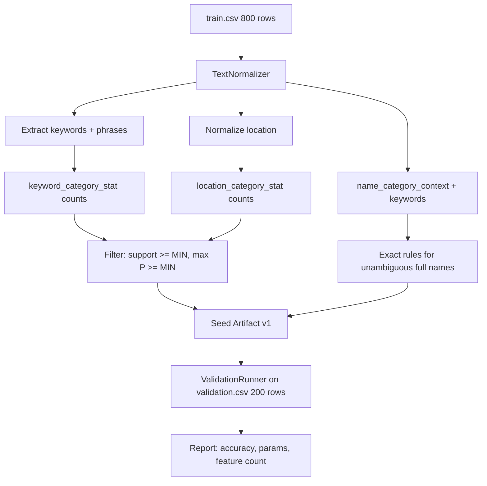
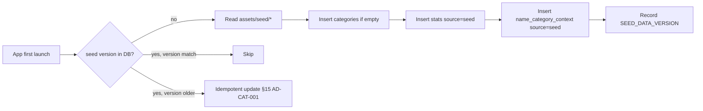

# План подготовки seed-датасета, генерации и поставки

## 1. Назначение

Документ описывает полный цикл cold start для автокатегоризации:

1. подготовка размеченного датасета;
2. офлайн-«обучение» (генерация seed-счётчиков);
3. включение артефакта в поставку приложения.

«Обучение» здесь — **не ML**: это детерминированная обработка размеченного CSV
модулем `:seed-generator` с общим `TextNormalizer`. Runtime-обучение — отдельно,
счётчиками при интерактивном сохранении расхода (§11 `AD-CAT-001`).

Поиск и автодополнение **мест** — отдельный механизм (FTS по таблице `location`,
§12 `AD-CAT-001`). Seed даёт только сигнал «место → категория», но не наполняет
историю мест для autocomplete.

---

## 2. Целевой объём датасета

| Параметр | Значение |
|---|---|
| **Итого строк** | **1 000** |
| **Категорий** | 10 встроенных |
| **Строк на категорию** | **100** (равномерно) |
| **Train** | 800 строк (80 на категорию, 80 %) |
| **Validation** | 200 строк (20 на категорию, 20 %) |
| **Источник** | синтетический, без персональных данных |
| **Лицензия** | собственная, репозиторий проекта |

Validation-набор **не пересекается** с train по `normalized_name` после
нормализации. Разбиение — stratified по `category_code`.

---

## 3. Структура репозитория

```text
seed-data/
├── README.md                      # как воспроизвести, ссылка на этот документ
├── categories.yaml                # code → name (единый источник правды)
├── categorization-config.json     # зафиксированные параметры после validation
├── raw/
│   ├── train.csv                  # 800 строк
│   └── validation.csv             # 200 строк
└── reports/                       # gitignore или коммит последнего отчёта
    └── seed-v1-validation.json

app/src/main/assets/seed/          # поставляемый артефакт (коммитится)
├── manifest.json
├── categorization-config.json
├── keyword_stats.json
├── location_stats.json
├── name_contexts.json
└── exact_rules.json               # опционально

:seed-generator/                   # Kotlin/JVM CLI (см. §6)
```

---

## 4. Формат данных

### 4.1. CSV

Минимальные поля (§8.1 `AD-CAT-001`):

```csv
name,location,category_code
Кетостерил,Столичка на Чкалова,HEALTH
Латте,Шоколадница,CAFE
Бензин,Лукойл,TRANSPORT
```

- `name` — обязательно;
- `location` — может быть пустым (только keyword-сигналы);
- `category_code` — стабильный код из `categories.yaml`.

### 4.2. Маппинг категорий

| code | Категория | Строк в train | Строк в validation |
|---|---|---:|---:|
| `GROCERIES` | Продукты | 80 | 20 |
| `CAFE` | Кафе | 80 | 20 |
| `TRANSPORT` | Транспорт | 80 | 20 |
| `HEALTH` | Здоровье | 80 | 20 |
| `HOUSING` | Жильё | 80 | 20 |
| `COMMUNICATION` | Связь | 80 | 20 |
| `ENTERTAINMENT` | Развлечения | 80 | 20 |
| `CLOTHING` | Одежда | 80 | 20 |
| `HOME` | Дом | 80 | 20 |
| `OTHER` | Прочее | 80 | 20 |

Коды совпадают с полем `category.code` в Room и с иконками из макета Figma.

---

## 5. Подготовка датасета

### 5.1. Принципы наполнения

**По названиям (`name`) — на каждую категорию ~100 уникальных формулировок:**

- бренды и разговорные формы (`латте`, `latte`, `кофе латте`);
- многословные фразы в кавычках: `"сухой корм"`, `"молоко 3.2%"`;
- варианты написания и опечатки, проходящие через `TextNormalizer`;
- **ambiguity-кейсы** для validation: слова, встречающиеся в нескольких категориях
  (`перекус`, `подарок`, `ремонт`).

**По местам (`location`) — повторяющийся пул сетей и типовых названий:**

- **однозначные места** (≥ 70 % одной категории): `Шоколадница` → CAFE,
  `Столичка` → HEALTH, `Лукойл` → TRANSPORT;
- **неоднозначные места** (супермаркеты): `Пятёрочка`, `Магнит` — смесь
  GROCERIES / HOME / HEALTH; не создавать seed exact rule для такого места;
- варианты написания: `Пятёрочка`, `Pyaterochka`, `Пятерочка на Ленина`;
- ~30–40 % строк — с пустым `location` (категория только по названию).

**Распределение location по категориям (ориентир на 100 строк):**

| Категория | Однозначные места (примеры) | Доля строк с location |
|---|---|---:|
| GROCERIES | Пятёрочка, Магнит, ВкусВилл | ~70 % |
| CAFE | Шоколадница, Starbucks, Coffee Like | ~80 % |
| TRANSPORT | Лукойл, Яндекс Go, Метро | ~75 % |
| HEALTH | Столичка, 36,6, Invitro | ~80 % |
| HOUSING | УК, аренда (текстовые места) | ~50 % |
| COMMUNICATION | МТС, Билайн, Yota | ~60 % |
| ENTERTAINMENT | Кинопарк, Ticketland, Steam | ~55 % |
| CLOTHING | Zara, H&M, Lamoda | ~65 % |
| HOME | IKEA, Леруа Мерлен, OBI | ~70 % |
| OTHER | разные / пусто | ~20 % location |

### 5.2. Обязательные golden-строки

Должны быть и в train, и проверяться unit-тестами после генерации seed:

| name | location | category_code | Назначение |
|---|---|---|---|
| Латте | Шоколадница | CAFE | demo cold start |
| Кетостерил | Столичка на Чкалова | HEALTH | name + location |
| Бензин | Лукойл | TRANSPORT | место-триггер |
| Хлеб | *(пусто)* | GROCERIES | только keyword |
| Непонятная покупка | *(пусто)* | OTHER | fallback |
| Врач | Поликлиника | HEALTH | транзит «врач» |
| Стоматолог | Стоматология | HEALTH | транзит «стоматолог» |

### 5.3. Контексты для транзитов (критично)

Seed-артефакт **обязан** содержать не только агрегаты, но и (§19.7 `AD-CAT-001`):

- `name_category_context` — последняя категория для каждого `normalized_name`;
- `name_category_context_keyword` — связь слово ↔ контекст.

Генератор строит их при обработке train.csv так же, как runtime при сохранении.
Без контекстов транзиты после исправления (`врач` vs `стоматолог`) работают некорректно.

### 5.4. Validation-набор

200 строк, 20 на категорию. Включает:

- edge cases (конфликт name vs location: «Аспирин» в «Пятёрочке»);
- редкие формулировки, не дублирующие train по `normalized_name`;
- строки для замера fallback rate.

**Метрики validation** (целевые после подбора параметров):

| Метрика | Цель |
|---|---|
| top-1 accuracy | ≥ 85 % |
| top-3 recall | ≥ 95 % |
| fallback rate (OTHER) | < 15 % |
| конфликты name/location | документированы, не ломают demo |

### 5.5. Этапы подготовки (ручная работа)

| Шаг | Действие | Объём | Этап плана |
|---|---|---|---|
| S1 | `categories.yaml`, структура `seed-data/` | — | B0 |
| S2 | Минимальный train.csv (~30 строк) | cold start на день 1 | B0 |
| S3 | Полный train.csv | 800 строк | B3 |
| S4 | validation.csv | 200 строк | B3 |
| S5 | Валидация формата (скрипт/тест) | CI | B3 |
| S6 | Подбор параметров на validation | grid search | B3 |
| S7 | Финальный seed-артефакт v1 | assets/seed/ | B3 |

---

## 6. Проведение генерации (`:seed-generator`)

### 6.1. Модуль

Kotlin/JVM CLI, зависит от `:core:categorization` — **общий `TextNormalizer`**
с приложением. Python или отдельная реализация нормализатора не допускаются.

```text
:seed-generator/
├── src/main/kotlin/
│   ├── SeedDataGenerator.kt       # main entry
│   ├── DatasetReader.kt           # CSV → rows
│   ├── CounterBuilder.kt          # feature × category counts
│   ├── ContextBuilder.kt          # name_category_context*
│   ├── SeedFilter.kt              # MIN_SEED_SUPPORT / PROBABILITY
│   ├── ValidationRunner.kt        # метрики на validation.csv
│   └── SeedArtifactWriter.kt      # JSON → assets/seed/
└── build.gradle.kts
```

### 6.2. Pipeline



**Шаги:**

1. Прочитать `train.csv`, нормализовать через production-нормализатор.
2. Для каждой строки: инкремент `count(keyword, category)`, `count(location, category)`.
3. Построить контексты имён (как §11.2 `AD-CAT-001`, без user/expense).
4. Отфильтровать признаки по `MIN_SEED_SUPPORT` и `MIN_SEED_PROBABILITY`.
5. Опционально: seed exact rules для `normalized_name` с однозначной категорией
   (support ≥ N, P = 1.0).
6. Прогнать `CategorizationEngine` на `validation.csv` с grid search параметров.
7. Записать артефакт в `app/src/main/assets/seed/` + отчёт в `seed-data/reports/`.

### 6.3. Подбор параметров

Стартовые значения (§8.2, §21 `AD-CAT-001`):

| Параметр | Старт | Диапазон grid |
|---|---|---|
| `MIN_SEED_SUPPORT` | 3 | 2–5 |
| `MIN_SEED_PROBABILITY` | 0.70 | 0.60–0.85 |
| `MAX_SEED_STRENGTH` | 50 | 20–100 |
| `NAME_WEIGHT` | 2.0 | 1.0–3.0 |
| `LOCATION_WEIGHT` | 1.0 | 0.5–2.0 |
| `LAPLACE_ALPHA` | 0.5 | 0.1–1.0 |

Выбрать конфигурацию с max top-1 на validation при fallback rate < 15 %.
Зафиксировать в `seed-data/categorization-config.json` и скопировать в assets.

### 6.4. Gradle-задача

```kotlin
tasks.register<JavaExec>("generateSeed") {
    classpath = sourceSets["main"].runtimeClasspath
    mainClass.set("com.olegbelyanin.expensetracker.seed.SeedDataGeneratorKt")
    args(
        "--train", "../seed-data/raw/train.csv",
        "--validation", "../seed-data/raw/validation.csv",
        "--output", "../app/src/main/assets/seed/",
        "--config", "../seed-data/categorization-config.json",
        "--categories", "../seed-data/categories.yaml",
    )
}
```

Команда: `./gradlew :seed-generator:generateSeed`

### 6.5. Golden-тесты (§18.1 `AD-CAT-001`)

Один набор тестов в `:core:categorization` и проверка после `:seed-generator:generateSeed`:

- нормализация (`е/ё`, кавычки, регистр);
- «Латте» → CAFE после загрузки seed;
- «врач / стоматолог» — транзитные сценарии;
- идемпотентность seed-импорта;
- одинаковые golden-тесты для приложения и генератора.

---

## 7. Включение в поставку

### 7.1. Формат seed-артефакта

```json
// app/src/main/assets/seed/manifest.json
{
  "seedDataVersion": 1,
  "normalizerVersion": 1,
  "generatedAt": "2026-09-03",
  "trainRows": 800,
  "validationRows": 200,
  "validationTop1Accuracy": 0.87,
  "keywordFeatures": 0,
  "locationFeatures": 0
}
```

Файлы артефакта:

| Файл | Содержимое |
|---|---|
| `manifest.json` | версии, метрики, дата генерации |
| `categorization-config.json` | зафиксированные параметры |
| `keyword_stats.json` | `[{keyword, category_code, count}]` |
| `location_stats.json` | `[{location, category_code, count}]` |
| `name_contexts.json` | `[{normalized_name, category_code, keywords[]}]` |
| `exact_rules.json` | `[{normalized_name, category_code}]` — опционально |

Seed-арtefact **коммитится** в репозиторий. CI проверяет соответствие train.csv + config.

### 7.2. Импорт при старте приложения



Правила обновления (§15 `AD-CAT-001`):

- заменять **только** строки `source=seed`;
- не трогать `source=user`, exact rules, learning examples;
- после обновления — перепроверить активные транзиты.

### 7.3. Места: seed vs runtime

| Механизм | Источник | Назначение |
|---|---|---|
| `location_category_stat` | seed CSV | сигнал категоризации |
| `location` + FTS | runtime (ввод пользователя) | автодополнение §12 |

Seed **не** создаёт записи в `location`. При первом вводе «Шоколадница» autocomplete
может быть пуст, но категоризация уже работает через `location_category_stat`.

**Опционально для demo (не обязательно по ТЗ):** pre-seed 20–30 типовых мест в `location`
без расходов — только для красивого autocomplete на демо.

### 7.4. CI

В `.github/workflows/ci.yml` (этап I3):

```yaml
- name: Generate seed artifact
  run: ./gradlew :seed-generator:generateSeed

- name: Verify seed is committed
  run: git diff --exit-code app/src/main/assets/seed/

- name: Run categorization tests
  run: ./gradlew :core:categorization:test
```

### 7.5. Документация для сдачи

В `README` (требование SC-TA-001 §9):

- одностраничное описание алгоритма (дерево решений §10.1 `AD-CAT-001`);
- ссылка на `seed-data/` и команду `./gradlew :seed-generator:generateSeed`;
- validation accuracy и зафиксированные параметры;
- явная формулировка: «детерминированный вероятностный словарь, не ML».

---

## 8. Риски и митигация

| Риск | Митигация |
|---|---|
| Python/Kotlin нормализатор разойдутся | только Kotlin CLI, общий модуль |
| Seed подавляет пользователя | `MAX_SEED_STRENGTH` + `source=seed/user` |
| Нет контекстов → транзиты ломаются | `ContextBuilder`, тест «врач/стоматолог» |
| Мало OTHER в датасете → завышенная accuracy | 100 строк OTHER, отдельные validation-кейсы |
| Переобучение на train | validation hold-out 200 строк, фиксация параметров |
| Место не подсказывается до первого ввода | ожидаемо; опциональный pre-seed для demo |
| 1000 строк — трудоёмко вручную | генератор синтетики по шаблонам (скрипт в seed-data/) |

---

## 9. Связь с этапами [`implementation-work-plan.md`](./implementation-work-plan.md)

| Этап | Что делать по seed |
|---|---|
| **B0** | `seed-data/` каркас, `categories.yaml`, минимальный train (~30 строк), stub assets |
| **B3** | `:seed-generator`, полный train 800 + validation 200, подбор параметров, финальный assets |
| **B6** | golden-тесты на seed; demo-данные для UI **отдельно** от seed (не путать) |
| **I3** | CI: `generateSeed` + diff assets + categorization tests |

Demo-набор для списка/аналитики (B6) и seed-датасет — **разные сущности**:

- seed — только для cold start категоризации;
- demo — расходы с суммами и датами для UI/NFR, генерируются локально или отдельным скриптом.

---

## 10. Трассировка к ТЗ

| Требование | Как закрывает этот план |
|---|---|
| F-03 | seed-словарь 1000 примеров → cold start без ручного выбора |
| F-04 | seed не мешает runtime-обучению (`source` разделён) |
| F-08 | всё локально, артефакт в assets |
| B-04 | воспроизводимый `:seed-generator` + CI |
| SC-TA-001 §9 | README описывает алгоритм и процедуру генерации |
